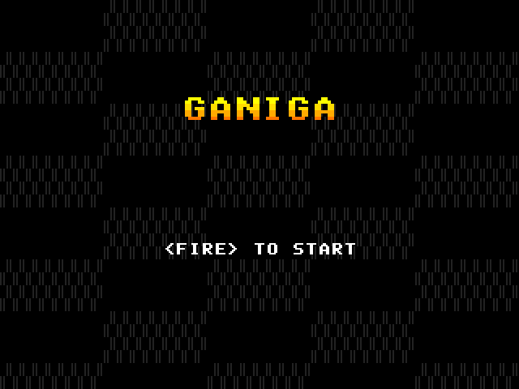
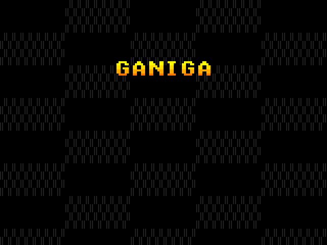
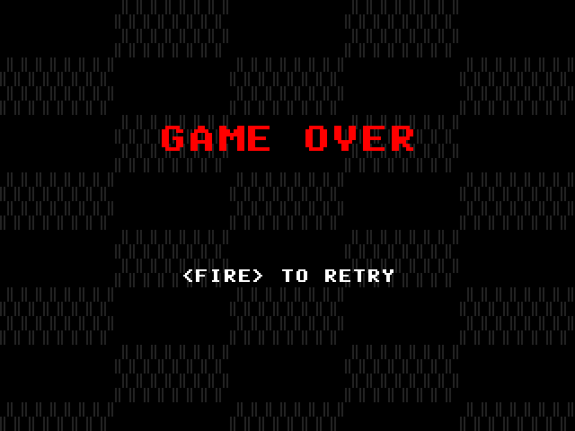
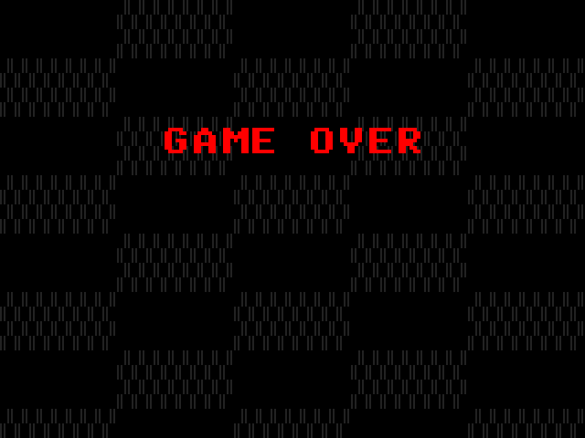
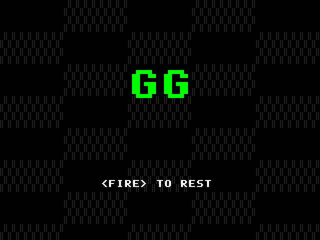
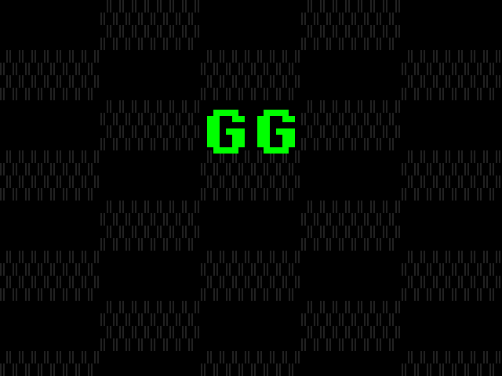
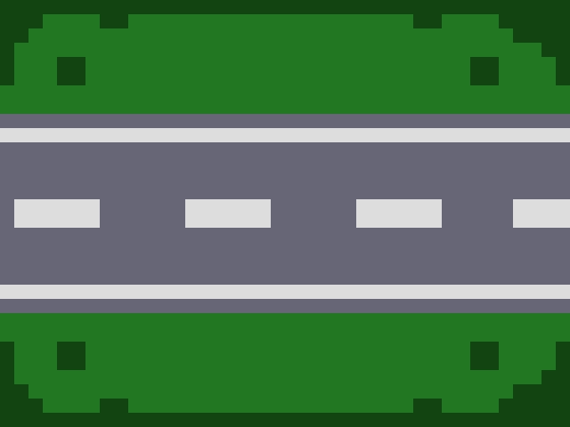

# Ganiga - FPGA Hardware Arcade Game

**Ganiga** is a high-performance, real-time arcade-style shooter implemented entirely in Verilog HDL. Designed for FPGA platforms, it features a modular architecture, hardware-accelerated rendering, and a robust game engine optimized for 60Hz display cycles.

## Project Overview

The project implements a classic "Galaga-inspired" experience, featuring:
- **640x480 VGA Graphics**: Real-time video generation at 60Hz.
- **Hardware Game Engine**: Collision detection, movement logic, and state management handled in concurrent hardware blocks.
- **Modular Renderer**: Separate rendering paths for game entities, UI, and menus.
- **PS/2 and UART Support**: Infrastructure for peripheral input and debug (available in source, with primary control via onboard buttons).

---

## System Architecture

The design follows a strictly hierarchical structure centered around the `top_module.v`.

### Top-Level Module (`top_module.v`)
This module integrates all major components of the Ganiga game. It handles the primary clock input, debounces button inputs, orchestrates the game engine and renderer, and outputs the VGA synchronization and RGB color signals. It defines global game parameters such as enemy movement delays and step sizes.

### 1. Clock and Timing Control
- **`clk_divider.v`**: A generic clock divider module, currently not instantiated in `top_module.v` but available for generating slower clock domains from a high-frequency input.
- **`game_tick.v`**: Generates a precise 60Hz game tick signal from the system clock (100MHz), ensuring consistent game speed and frame rate independent of varying clock speeds.
- **`vga_sync.v`**: Produces standard horizontal (HS) and vertical (VS) synchronization signals for a 640x480 VGA display at 60Hz. It also generates `x` and `y` coordinates for the current pixel and a `blank` signal for non-display areas.

### 2. Game Engine (`game_engine.v`)
The central logic controller for all game mechanics, coordinating player, enemy, and bullet interactions.
- **`menu_fsm.v`**: Implements the finite state machine (FSM) for managing game states: `MENU`, `PLAYING`, `GAMEOVER`, and `WIN`. It handles transitions based on player input and game events (player hit, player won).
- **`player_control.v`**: Manages the player's horizontal movement based on `btn_left` and `btn_right` inputs, ensuring the player stays within screen bounds.
- **`bullet.v`**: Handles the player's bullet logic, including firing (on `btn_fire` release), upward movement, and deactivation upon hitting an enemy or going off-screen.
- **`enemy_control.v`**: Manages the enemy swarm's behavior, including group movement (left, right, up, down), firing logic, and collision detection with player bullets. It also handles wave progression and determines game victory conditions.
- **`enemy_bullet_manager.v`**: Manages up to three concurrent enemy bullets. It allocates bullet slots, detects collisions with the player, and propagates player hit signals.
- **`enemy_bullet.v`**: Implements the individual logic for an enemy bullet, including spawning at a specified location, downward movement, and deactivation upon hitting the player or going off-screen.

### 3. Rendering Pipeline (`renderer.v`)
A dedicated module responsible for composing the final video frame by layering various graphical elements.
- **`player_sprite.v`**: Renders the player sprite at its current `(x, y)` coordinates using data from `player_sprite_rom.v`.
- **`player_sprite_rom.v`**: A Block RAM-based ROM storing the 16x16 pixel sprite data for the player, initialized from `player_1.mem`.
- **`enemy_sprite.v`**: Renders individual enemy sprites based on their group position, relative index, and alive status, using data from `enemy_sprite_rom.v`.
- **`enemy_sprite_rom.v`**: A Block RAM-based ROM storing the 16x16 pixel sprite data for enemies, initialized from `enemy.mem`.
- **`font8x8_rom.v`**: A ROM containing 8x8 pixel bitmap glyphs for various ASCII characters, used for rendering text on menu, game over, and win screens.
- **`tile_map.v`**: Renders a background tile map using a memory-mapped approach, where each tile is 16x16 pixels and corresponds to a `tile_id` from `map.mem`. It assigns RGB colors based on `tile_id` and can identify "wall" tiles.
- **`screen_menu.v`**: Generates the visuals for the main menu screen, including the "GANIGA" title and a blinking " <FIRE> TO START" prompt. It features a starfield background effect and a gradient title color.
- **`screen_game_over.v`**: Generates the "GAME OVER" screen with a blinking " <FIRE> TO RETRY>" prompt, along with a starfield background.
- **`screen_win.v`**: Generates the "GG" win screen with a blinking " <FIRE> TO RESET!>" prompt, also featuring a starfield background.

### 4. Input/Output Modules
- **`btn_debounce.v`**: A placeholder module for button debouncing, currently empty but intended for stable button input.
- **`keyboard_decoder.v`**: Decodes PS/2 keyboard scan codes for Left Arrow, Right Arrow, and Spacebar, mapping them to game actions (`btn_left`, `btn_right`, `btn_fire`). It handles key press and release events.
- **`ps2_rx.v`**: Receives data from a PS/2 device (e.g., keyboard) by synchronizing the `ps2_clk` signal and detecting falling edges to sample `ps2_data` bits. It extracts 8-bit data packets and provides a `rx_done_tick` signal.
- **`uart_rx.v`**: A basic UART receiver module. It samples the `rx` line to detect start bits, then collects data bits at a specified baud rate (9600 for a 100MHz clock) and outputs an 8-bit data byte when a valid packet is received.

---

## Memory Initialization Files

These files provide initial data for ROMs and memory blocks within the FPGA design.
- **`enemy.mem`**: Memory initialization file (HEX format) for the `enemy_sprite_rom`, defining the pixel data for enemy sprites.
- **`map.mem`**: Memory initialization file (HEX format) for the `tile_map`, defining the tile IDs for the game's background map. Each entry corresponds to a 16x16 tile.
- **`player_1.mem`**: Memory initialization file (HEX format) for the `player_sprite_rom`, defining the pixel data for the player's sprite.
- **`player.coe`**: Xilinx Core Initialization (COE) file format for the player sprite, containing the same data as `player_1.mem` but in a format compatible with Xilinx IP cores (e.g., Block Memory Generator).

---

## Hardware Specifications

| Component         | Specification               |
|-------------------|-----------------------------|
| **HDL**           | Verilog-2001                |
| **Clock Frequency**| 100 MHz                     |
| **Video Output**  | VGA 640x480 @ 60Hz (RGB 4-4-4)|
| **Primary Inputs**| BTNC (Reset), BTNL/R (Move), BTNU (Fire) |
| **Memory**        | Block RAM for Tile Maps and Sprites |
| **Peripherals**   | PS/2 (Keyboard), UART (Debug) |

---

## Project Structure

```text
Ganiga.srcs/sources_1/new/
├── top_module.v           # Top-level integration
├── game_engine.v          # Central logic controller
├── renderer.v             # Video composition and sprite blitting
├── vga_sync.v             # VGA timing generation
├── game_tick.v            # 60Hz game clock generation
├── clk_divider.v          # Generic clock divider (unused in top)
├── menu_fsm.v             # Game state machine
├── player_control.v       # Player movement logic
├── bullet.v               # Player bullet logic
├── enemy_control.v        # Enemy AI and swarm logic
├── enemy_bullet_manager.v # Manages enemy projectiles
├── enemy_bullet.v         # Individual enemy bullet logic
├── player_sprite.v        # Player sprite rendering
├── player_sprite_rom.v    # ROM for player sprite data
├── enemy_sprite.v         # Enemy sprite rendering
├── enemy_sprite_rom.v     # ROM for enemy sprite data
├── font8x8_rom.v          # ROM for 8x8 font glyphs
├── tile_map.v             # Background tile map rendering
├── screen_menu.v          # Menu screen display
├── screen_game_over.v     # Game over screen display
├── screen_win.v           # Win screen display
├── btn_debounce.v         # Button debouncing (placeholder)
├── keyboard_decoder.v     # PS/2 keyboard scan code decoder
├── ps2_rx.v               # PS/2 receiver
├── uart_rx.v              # UART receiver
├── enemy.mem              # Enemy sprite memory initialization
├── map.mem                # Tile map memory initialization
├── player_1.mem           # Player sprite memory initialization
└── player.coe             # Player sprite COE initialization
```

## Implementation Notes

The design is optimized for synthesis with a focus on resource efficiency and timing closure. By utilizing dedicated hardware blocks for game logic, the system achieves zero-latency input response. The modularity of the renderer allows for easy expansion of visual assets without impacting the core timing of the game engine.

---

## 📸 Game Gallery (Screenshots)

Here are some visual captures of the hardware-rendered screens in Ganiga, showcasing the dynamic blinking effects for player prompts and the background tile rendering.

### Main Menu
| Blink ON | Blink OFF |
| :---: | :---: |
|  |  |

### Game Over Screen
| Blink ON | Blink OFF |
| :---: | :---: |
|  |  |

### Victory Screen (GG)
| Blink ON | Blink OFF |
| :---: | :---: |
|  |  |

### Game Assets
|Background Tile Map Render|
| :---: |
||

---

## Future Enhancements
- [ ] **Audio Integration**: PWM or I2S based sound effect engine.
- [ ] **Extended PS/2 Keyboard**: Full keyboard support for more comprehensive control.
- [ ] **Advanced Swarm AI**: More complex enemy flight paths, formations, and attack patterns.
- [ ] **Score System**: Hardware-based BCD counters for high-score tracking and persistent storage.
- [ ] **Difficulty Levels**: Implement selectable difficulty settings affecting enemy behavior and game speed.

---
*Developed as a high-integrity hardware demonstration project.*
## Created by:
- 67070501022 Thanawat Suntarawattana
- 67070501060 Songwit Rueangsawat
- 67070501081 Tanadet Nuchaikaew
- 67070501084 Phongsatorn Phuttasorn
